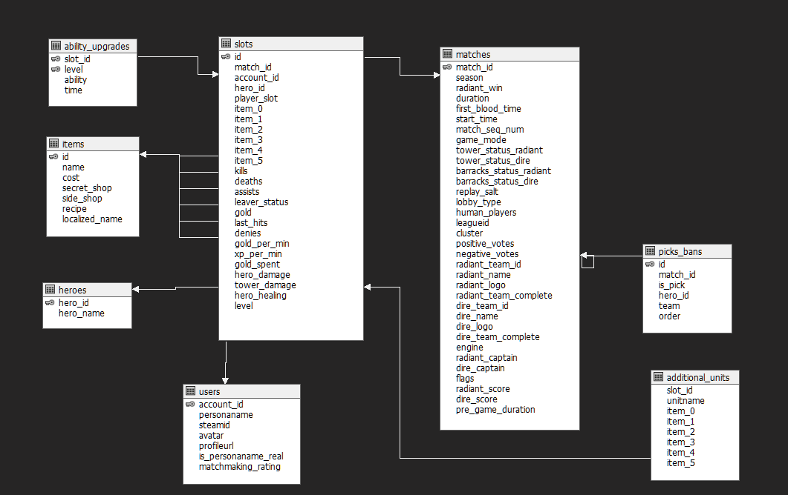
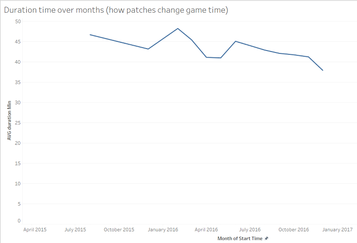
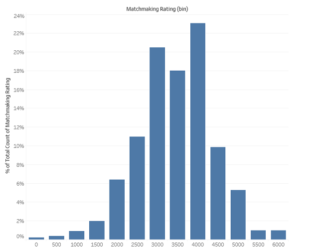

# Dota 2 data mining project

This project had the objective to populate a database with recent Dota 2 matches, for data mining and OLAP analysis.

## Dependencies:
- [dota2-api](https://github.com/kronusme/dota2-api/)
- [dota2](https://github.com/ValvePython/dota2)
- [peewee](https://github.com/coleifer/peewee)
- Python 2.7
- MySQL database
- PHP 7.1

## Scripts description

There are 3 main scripts that need to be executed in order to make it run:
- CreateDB.sql: Run this on your MySQL server database in order to set up the required tables and relationships
- PopulateDB.php: This script uses the [dota2-api](https://github.com/kronusme/dota2-api/) php library to fetch data from various users using the steam API, and populate the DB accordingly.
- mmrPopulator.py: This scripts uses the [dota2](https://github.com/ValvePython/dota2) python library to get the matchmaking rating (MMR) of different players found on the database, if that player enabled others to see it. MMR is not stored on the default Steam API, so this step is necessary (and much slower), to get this additional data.

There is also a script (CreateHeroes.py) for populating a Heroes table in order to have more user friendly results with hero names.

## Database Model

## Results

